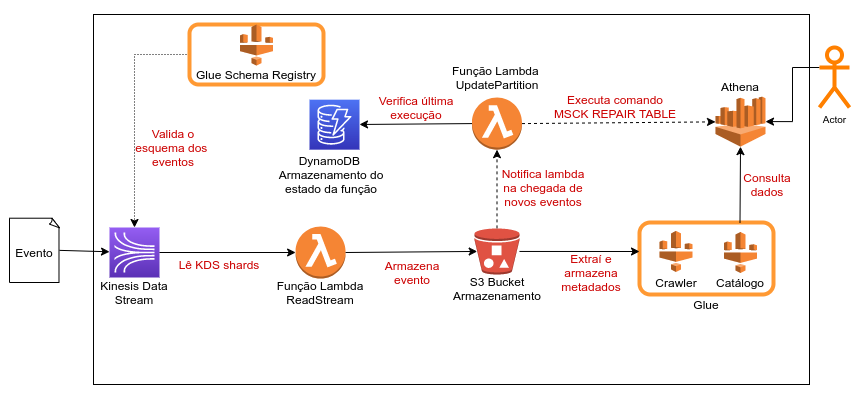

# data-challenge

Este teste é composto por três exercícios. Nos exercícios 1 e 2 você
será avaliado pela qualidade, otimização e eficiência do código e, no
exercício 3, pelo desenho de arquitetura. Faça um fork desse projeto e
salve seu desenvolvimento nele, pois é no seu repositório que faremos
a avaliação.

Uma empresa de tecnologia está iniciando sua jornada em dados. Em um
primeiro momento decidiram investir na criação de um MVP de uma
plataforma de dados, utilizando serviços da AWS (Fig. 1), para validar o
seu potencial. Atenta às boas práticas na construção de plataformas como
essa, a empresa adotou desde o início o princípio de analytics by
design: todos os produtores de informações se adaptaram para enviar
eventos à plataforma com o seu layout já definido e documentado.


1.  O seu time ficou responsável pela construção desse fluxo de ingestão
    de dados e você pelo módulo de Data Quality deste fluxo. Este módulo
    vai escutar uma fila, validar os eventos trafegados nela a partir de
    JSONs Schemas armazenados em um repositório, e enviar para uma outra
    fila (valid-events-queue).\
    \
    Construa esse módulo em python a partir dos arquivos
    disponibilizados para você na pasta "exercicio1". Você pode ficar à
    vontade para propor melhorias, mas fique atento aos pontos a seguir:

    -   Use o JSON Schema disponibilizado na pasta do exercício
        (schema.json) para validar o evento, sem o auxílio de
        bibliotecas externas de validação, e garantindo que:

        i.  Tipo do campo do evento deve bater com o do schema.

        ii. Não deve aceitar campos não cadastrados no schema.

    -   Evento de saída deve ser igual ao de entrada.

    -   Desenvolva seu código no arquivo "event_validator.py". É a
        função "handler" deste arquivo que será estimulada sempre que um
        novo evento cair na fila e utilize a função
        "send_event_to_queue" para enviar eventos.

    -   Execute \'python main.py\' para simular o fluxo.

    # Solução

    **Esta solução utiliza a ferramenta `pipenv` para realizar o gerenciamento das 
    dependências do projeto de maneira consistente. Para testá-la, 
    reproduza os comandos abaixo:**

    1. Instale pipenv e suas depedências: `$ pip install pipenv`
    2. Clone este repositório: `$ git clone git@github.com:gPass0s/data-challenge.git`
    3. Acesse a pasta raiz do projeto: `$ cd data-challange`
    4. Inicialize o ambiente virtual: `$ pipenv install && pipenv shell`
    5. Simule o fluxo: `$ pipenv run python desafios/exercicio1/main.py`
        ```bash
        ~/data-challenge$ pipenv run python desafios/exercicio1/main.py
        Response status code: [200]
        ```

    6. Execute os testes unitários: `$ pipenv run python -m pytest -vv tests/`
        ```bash
        ~/projects/data-challenge$ pipenv run python -m pytest -vv tests/
        ============================================================================= test session starts ==============================================================================
        platform linux -- Python 3.7.2, pytest-6.1.2, py-1.9.0, pluggy-0.13.1 -- /home/guilhermepassos/.local/share/virtualenvs/data-challenge-PTcfleLB/bin/python
        cachedir: .pytest_cache
        rootdir: /home/guilhermepassos/projects/data-challenge
        collected 6 items                                                                                                                                                              

        tests/test__checkers.py::test_schema PASSED                                                                                                                              [ 16%]
        tests/test__checkers.py::test_type PASSED                                                                                                                                [ 33%]
        tests/test__checkers.py::test_required PASSED                                                                                                                            [ 50%]
        tests/test__checkers.py::test_properties_fail PASSED                                                                                                                     [ 66%]
        tests/test__checkers.py::test_properties_pass PASSED                                                                                                                     [ 83%]
        tests/test__checkers.py::test_event_type PASSED                                                                                                                          [100%]

        ============================================================================== 6 passed in 0.03s ===============================================================================
        ```

2.  É muito comum que os usuários da plataforma queiram fazer análises
    exploratória nos eventos armazenados na plataforma de dados. Você
    teve a ideia de construir um módulo que automatiza a criação de
    tabelas no AWS Athena a partir do mesmo JSON Schema utilizado no
    módulo de Data Quality.\
    \
    Construa esse módulo em python a partir dos arquivos
    disponibilizados para você na pasta "exercicio2" e garanta que ele
    crie queries de create table com todos os campos e tipos declarados
    no schema. Fique atento aos seguintes pontos:

    -   Utilize o arquivo "json_schema_to_hive.py" para desenvolver seu
        código e a função "create_hive_table_with_athena" para criação
        da tabela.

    -   Consulte a documentação de CREATE TABLE no Athena
        (<https://docs.aws.amazon.com/athena/latest/ug/create-table.html>)

    -   Execute \'python main.py\' para simular.

    # Solução

    **Assim como a solução anterior, esta utiliza a ferramenta `pipenv`. Deste
    modo, a partir do item IV da implementação anterior, execute o seguinte comando:**

    1. Simule o fluxo: `$ pipenv run python desafios/exercicio2/main.py`
        ``` bash
        ~/projects/data-challenge$ pipenv run python desafios/exercicio2/main.py
        Query: CREATE EXTERNAL TABLE IF NOT EXISTS data-challange.events (
        eid STRING,
        documentNumber STRING,
        name STRING,
        age INTEGER,
        address STRUCT <
            street:STRING,
            number:INTEGER,
            mailAddress:BOOLEAN,
            >
        )
        ROW FORMAT SERDE 'org.apache.hadoop.hive.serde2.RegexSerDe'
        WITH SERDEPROPERTIES (
        'input.regex' = '^(?!#)([^ ]+)\s+([^ ]+)\s+([^ ]+)\s+([^ ]+)\s+([^ ]+)\s+([^ ]+)\s+([^ ]+)\s+([^ ]+)\s+([^ ]+)\s+([^ ]+)\s+[^\(]+[\(]([^\;]+).*\%20([^\/]+)[\/](.*)$'
        )
        LOCATION 's3://iti-query-results/';
        ```


3.  O projeto vingou! A área de negócio identificou muitas oportunidades
    nos dados disponibilizados. Você ficou responsável por propor um
    desenho de arquitetura, não exaustivo, de uma plataforma de dados.
    Não se prenda na solução feita no MVP, essa plataforma pode ser
    construída usando tanto serviços de provedores cloud como soluções
    open-source. Use o Draw.io, se quiser, e se atente ao seguintes
    requisitos:

    -   Solução de ingestão

    -   Pipeline etl

    -   Soluções de armazenamento

    -   Catálogo de Dados

    # Solução

    
    
    **Notas sobre a arquitetura apresentada acima:**

    1. Para a ingestão dos dados, sugere-se a utilização do Kinesis Data Stream. O KDS permite que os eventos
    sejam lidos mais de uma vez dentro da janela de tempo de retenção, permitindo assim que vários consumidores
    recebam os dados enviados pelos produtores de informações. Em outras palavras, o KDS implementa um
    PUB/SUB de dados.
    
    2. A validação do esquema do eventos enviados é realizada pelo AWS Glue Schema Registry.
    De acordo com sua <a href=https://docs.aws.amazon.com/glue/latest/dg/schema-registry.html>documentação</a>, o AWS Glue Schema Registry é capaz de realizar a validação e o controle do fluxo de um stream de dados usando esquemas Apache Avro. Além disso, é possível integrar o AWS Glue Schema Registry com o Kinesis Data Streams conforme descrito <a href=https://docs.aws.amazon.com/glue/latest/dg/schema-registry-integrations.html#schema-registry-integrations-kds>nesta</a> documentação da AWS.
    
    3. Após a validação dos eventos, uma função lambda é "trigada" automaticamente pelo KDS para realizar
    a leitura, processamento e armazenamento particionado do stream de eventos no S3.
    
    4. O S3, ao receber o stream de eventos, notifica automaticamente uma segunda lambda function que
    verifica se uma nova partição de dados foi criada no bucket para um determinado minuto, hora ou dia. Essa verificação é realizada por meio de uma tabela no DynamoDB que registra o momento em que o primeiro
    evento é armazenado num determinado minuto, hora ou dia. Para o primeiro evento armazenado numa determinada
    partição do S3, a função lambda executa o comando `MSCK REPAIR TABLE` no athena para que essa nova
    partição esteja disponível para consulta.
    
    5. De maneira programática, o Glue Crawler é utilizado para executar o escaneamento dos dados armazenados
    no S3 e atualização do repositório de metadados do Glue Catalog que será tulizados pelo Athena.

    6. Por fim, os eventos ficam disponivéis para realização de consultas SQL no AWS Athena.
